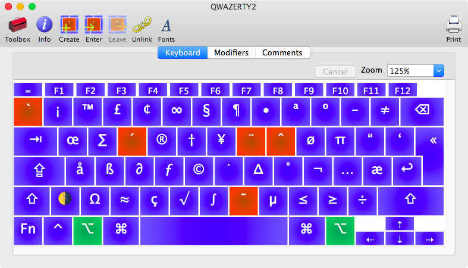

QWAZERTY
========

A keyboard layout for French AZERTY keyboards (or any [ISO
keyboard](https://en.wikipedia.org/wiki/ISO/IEC_9995)). It is intended to make
ISO keyboards more comfortable to use for Americans (and those who are
accustomed to ANSI QWERTY keyboards).

Based on the U.S. QWERTY layout, it reproduces all keys in QWERTY. Notably, the
"grave accent"/"tilde" key is restored to its normal position at the top left of
the keyboard (Apple's U.S. layout for ISO keyboards moves it next to the left
"Shift" key).

Additionally, the key next to the left "Shift" key, which doesn't exist on ANSI
keyboards, is changed to input a set of emoji glyphs. It provides four emojis in
total (one for each of the following modifiers: normal, Shift, Option,
Option-Shift). These emojis can be used for faster shortcuts. The single-key
normal mode emoji can, for example, be bound to a frequent action, enabling
access to functionality with a single button press.

Two versions of the layout exist. Both make the following changes to Apple's
built-in U.S. QWERTY layout:

* Move the "grave accent"/"tilde" key to the left of the "1" numeral key.
* Turn the key next to the left "Shift" into an "emoji" key.

In addition to those modifications, the `QWAZERTY.bundle` version swaps the "\"
and "Enter" keys. This may not work in all applications. To ensure the swap
works in all contexts, see the [Karabiner section](#karabiner).

## The Emoji Key
ISO keyboards have one more key than ANSI keyboards. QWAZERTY uses this "extra"
key as a special emoji key. The emojis aren't meant to be used for real, but
rather as a convenient identifier to rebind the key to any desired function.

Here are the emojis and corresponding key sequences:

+--------+----------------------+---------+
| Output | Key Sequence         | Unicode |
+--------+----------------------+---------+
|   🕳   | <Emoji>              | U+1F573 |
|   ⛳   | Shift–<Emoji>        | U+26F3  |
|   🌗   | Option–<Emoji>       | U+1F317 |
|   🌑   | Shift—Option—<Emoji> | U+1F311 |
+--------+----------------------+---------+

## Example Usage
Here is an extract from my `.vimrc` which adds bindings to run Ruby tests when
the special emoji key is pressed:

	nnoremap 🕳 :call RunCurrentSpecFile()
	nnoremap ⛳ :call RunNearestSpec()

## Screenshots

### QWAZERTY-normal enter key.bundle

### QWAZERTY.bundle

## Install
Copy either `QWAZERTY-normal enter key.bundle` or `QWAZERTY.bundle` to
`~/Library/Keyboard Layouts`.

Open the Keyboard panel in System Preferences. Click the "+" button. In the
"English" section, find and add the "QWAZERTY" layout. QWAZERTY then becomes
available as an input source.

## Karabiner
Two additional changes to the standard keyboard layout are provided via
configuration through [Karabiner-Elements](https://pqrs.org/osx/karabiner/).
This enables:

* Swapping the "Enter" and "\" keys
* Swapping the left "Shift" key and "emoji" key

The `QWAZERTY.bundle` version does the first swap, but it doesn't work in all
applications. For a complete solution, use `QWAZERTY-normal enter key.bundle` in
combination with the Karabiner config.

By making these two swaps, the positions of the keys are closer to their
counterparts on ANSI keyboards. This enables less reaching in the pinkie fingers
and the reuse of ANSI muscle memory.

The config can be installed by copying the hashes in `"simple_modifications"`
from `karabiner.part.json` into the corresponding spot in your
`~/.config/karabiner/karabiner.json`.

## License
QWAZERTY is dedicated to the public domain via the Unlicense (see the included
UNLICENSE file).
